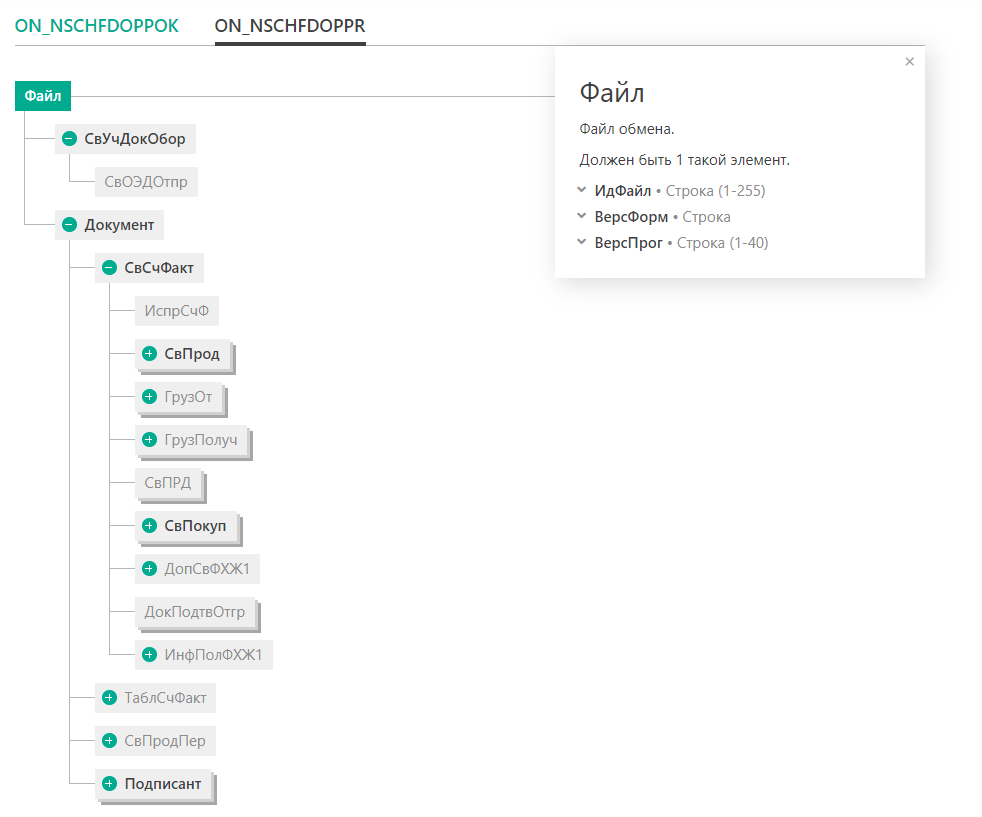

# Форматы документов

УПД и УКД — стандартные XML форматы для электронного документооборота.
Для создания документов в этих форматах на C# используются классы, 
сгенерированные на базе XSD-схем утилитой XmlSchemaClassGenerator:

* https://www.nuget.org/packages/XmlSchemaClassGenerator.Console/
* https://www.nuget.org/packages/dotnet-xscgen (то же самое, но оформлено в виде dotnet tool)

Последовательность действий при выходе новых версий XSD-схем этих форматов такая:

1. Скачивается XSD-схема (ссылки см. ниже)
2. Устанавливается генератор: dotnet tool install -g dotnet-xscgen
2. Генерируются классы в нужном namespace: xscgen upd.xsd -n ""=FairMark.Xsd.ON_NSCHFDOPPOK -sf
3. Копируются в проект FairMarkClient.

После этого можно создавать документы и сериализовывать их в XML обычным XmlSerializer-ом.
К сожалению, в XSD-схеме все названия русскоязычные, типа ФайлИнфПокИнфПокГосЗакКазнИнфСведДенОбяз.

Для документа УПД есть два варианта, две XSD-схемы: информация покупателя и информация продавца.
Структуры в них местами пересекаются, местами почти совпадают, но не идентичны на 100%.
Из-за этого сгенерированные классы пришлось положить в два отдельных пространства имен:

* FairMark.Xsd.ON_NSCHFDOPPOK -- информация покупателя
* FairMark.Xsd.ON_NSCHFDOPP -- информация продавца

Корневой элемент, с которого начинается заполнение УПД, в обоих случаях -- Файл.
То, что в нем заполняется дальше, зависит от типа документа (например, счет-фактура):

## Общее описание

* Неформальное описание УПД, УКД и др., примеры: https://sbis.ru/help/edo/primary/formats_doc
* Примеры готовых XML-документов: https://bi-cons.ru/xml/materials/vat-invoice-xml-xsd.html
* УПД и УКД. Найдите отличия: https://www.buhgalteria.ru/article/upd-i-ukd-naydite-otlichiya

## Универсальный передаточный документ (УПД)

* Неформальное описание: https://www.diadoc.ru/docs/upd
* Диаграммы и XSD-схемы: https://api-docs.diadoc.ru/ru/latest/docflows/UtdDocflow.html
* Тоже XSD-схемы: https://www.diadoc.ru/docs/forms/upd/structure/8

## Универсальный корректировочный документ (УКД)

* Пока не нашел